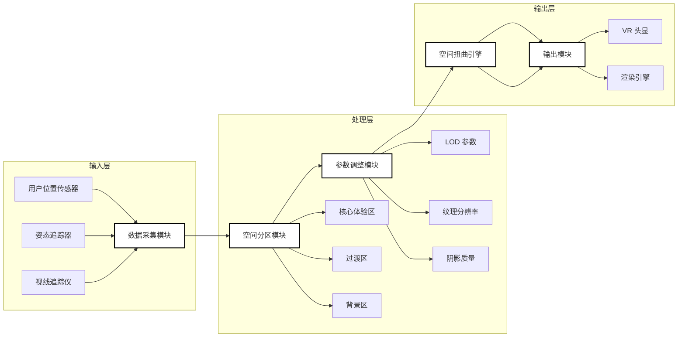
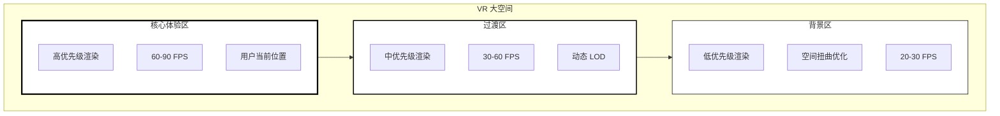
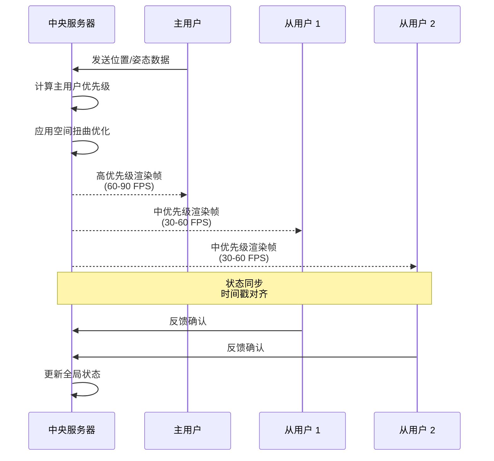

# 专利附图说明文档

**发明名称**：基于空间扭曲技术的 VR 大空间动态优化方法及系统

**申请号**：[待填写]

**申请人**：[待填写]

---

## 图 1：系统整体架构图

### 图注
本发明系统的整体架构框图，展示了从数据采集到最终输出的完整处理流程。

### 技术说明
- **数据采集模块**：负责采集用户位置、姿态、视线方向等实时数据
- **空间分区模块**：将 VR 大空间划分为核心体验区、过渡区、背景区
- **参数调整模块**：根据用户行为和场景需求动态调整渲染参数
- **空间扭曲引擎**：核心处理单元，执行空间扭曲算法
- **输出模块**：将优化后的渲染结果输出至 VR 显示设备

### Mermaid 代码


---

## 图 2：VR 大空间功能区域划分示意图

### 图注
VR 大空间的功能区域划分示意图，展示核心体验区、过渡区和背景区的空间布局关系。

### 技术说明
- **核心体验区**：用户主要活动区域，最高渲染质量，帧率优先保障
- **过渡区**：连接核心区和背景区的缓冲地带，中等渲染质量
- **背景区**：远景区域，采用空间扭曲技术降低渲染负载

### Mermaid 代码


---

## 图 3：动态参数调整流程图

### 图注
动态参数调整方法的流程步骤图，展示 S1-S5 的完整处理流程。

### 技术说明
- **S1**：实时监测用户位置和视线方向
- **S2**：计算各区域优先级权重
- **S3**：动态分配渲染资源
- **S4**：应用空间扭曲参数
- **S5**：输出优化后的渲染帧

### Mermaid 代码
```mermaid
flowchart TD
    S1[S1: 实时监测<br/>用户位置/视线方向] --> S2
    S2[S2: 计算区域<br/>优先级权重] --> S3
    S3[S3: 动态分配<br/>渲染资源] --> S4
    S4[S4: 应用空间<br/>扭曲参数] --> S5
    S5[S5: 输出优化后<br/>渲染帧] --> S1
    
    subgraph 监测阶段
        S1
    end
    
    subgraph 计算阶段
        S2
        S2a[权重公式:<br/>W = f(距离，视线角度，<br/>用户行为)]
    end
    
    subgraph 优化阶段
        S3
        S4
    end
    
    subgraph 输出阶段
        S5
    end
    
    style S1 fill:#fff,stroke:#000,stroke-width:2
    style S2 fill:#fff,stroke:#000,stroke-width:2
    style S3 fill:#fff,stroke:#000,stroke-width:2
    style S4 fill:#fff,stroke:#000,stroke-width:2
    style S5 fill:#fff,stroke:#000,stroke-width:2
```

---

## 图 4：多用户协同机制示意图

### 图注
多用户协同场景下的主用户 - 从用户同步机制示意图。

### 技术说明
- **主用户**：当前视角优先级最高的用户，决定全局渲染策略
- **从用户**：其他协同用户，采用差异化渲染策略
- **同步机制**：基于时间戳的状态同步，确保多用户体验一致性

### Mermaid 代码


---

## 图 5：文化沉浸场景应用示意图

### 图注
本发明在文化沉浸场景（故宫 VR 体验）中的应用示意图。

### 技术说明
- **应用场景**：故宫博物院 VR 虚拟游览
- **核心体验区**：主要展馆、文物展示区
- **优化效果**：在保持文物细节的同时，降低远景建筑渲染负载

### Mermaid 代码
```mermaid
graph TB
    subgraph Palace[故宫 VR 场景]
        subgraph CoreArea[核心体验区]
            C1[太和殿内部]
            C2[文物展示柜]
            C3[互动解说区]
        end
        
        subgraph TransArea[过渡区]
            T1[宫殿走廊]
            T2[庭院通道]
        end
        
        subgraph BackArea[背景区]
            B1[远景建筑群]
            B2[天空盒]
            B3[环境植被]
        end
    end
    
    CoreArea --> TransArea
    TransArea --> BackArea
    
    User((用户)) --> CoreArea
    
    note right of CoreArea: 高细节渲染<br/>文物纹理 4K
    note right of TransArea: 中细节渲染<br/>动态 LOD
    note right of BackArea: 空间扭曲优化<br/>降低 60% 渲染负载
    
    style CoreArea fill:#fff,stroke:#000,stroke-width:3
    style TransArea fill:#fff,stroke:#000,stroke-width:2
    style BackArea fill:#fff,stroke:#000,stroke-width:1
```

---

## 图 6：军事训练场景应用示意图

### 图注
本发明在军事训练场景（威胁感知优先级）中的应用示意图。

### 技术说明
- **应用场景**：VR 军事战术训练系统
- **威胁感知**：根据威胁等级动态调整渲染优先级
- **优化策略**：高威胁目标区域优先保障帧率和细节

### Mermaid 代码
```mermaid
graph TB
    subgraph Training[军事训练场景]
        subgraph HighThreat[高威胁区<br/>优先级最高]
            H1[敌方目标]
            H2[武器系统]
            H3[战术掩体]
        end
        
        subgraph MedThreat[中威胁区<br/>优先级中等]
            M1[友军单位]
            M2[任务目标点]
        end
        
        subgraph LowThreat[低威胁区<br/>优先级最低]
            L1[环境背景]
            L2[远景地形]
            L3[天空/云层]
        end
    end
    
    HighThreat --> MedThreat
    MedThreat --> LowThreat
    
    Commander((指挥官视角)) --> HighThreat
    
    note right of HighThreat: 90 FPS<br/>最高细节
    note right of MedThreat: 60 FPS<br/>标准细节
    note right of LowThreat: 30 FPS<br/>空间扭曲优化
    
    style HighThreat fill:#fff,stroke:#000,stroke-width:3
    style MedThreat fill:#fff,stroke:#000,stroke-width:2
    style LowThreat fill:#fff,stroke:#000,stroke-width:1
```

---

## 图 7：空间扭曲参数映射表示意图

### 图注
空间扭曲技术的参数映射关系示意图，展示输入参数到输出参数的转换过程。

### 技术说明
- **输入参数**：用户距离、视线角度、场景复杂度、硬件性能
- **映射函数**：f(x) = α·距离 + β·角度 + γ·复杂度
- **输出参数**：LOD 级别、纹理分辨率、阴影质量、扭曲强度

### Mermaid 代码
```mermaid
graph LR
    subgraph Input[输入参数]
        I1[用户距离 d]
        I2[视线角度θ]
        I3[场景复杂度 c]
        I4[硬件性能 h]
    end
    
    subgraph Mapping[映射函数]
        M1[f(x) = α·d + β·θ<br/>+ γ·c + δ·h]
        M2[权重系数:<br/>α=0.4, β=0.3<br/>γ=0.2, δ=0.1]
    end
    
    subgraph Output[输出参数]
        O1[LOD 级别]
        O2[纹理分辨率]
        O3[阴影质量]
        O4[扭曲强度]
    end
    
    I1 --> M1
    I2 --> M1
    I3 --> M1
    I4 --> M1
    
    M1 --> O1
    M1 --> O2
    M1 --> O3
    M1 --> O4
    
    style Input fill:#fff,stroke:#000,stroke-width:2
    style Mapping fill:#fff,stroke:#000,stroke-width:2
    style Output fill:#fff,stroke:#000,stroke-width:2
```

---

## 图 8：技术效果对比图

### 图注
采用本发明优化前后的技术效果对比图，展示帧率提升和渲染负载降低效果。

### 技术说明
- **对比指标**：平均帧率、帧率稳定性、渲染负载、内存占用
- **测试场景**：故宫 VR 游览场景（10000 平方米虚拟空间）
- **测试结果**：平均帧率提升 45%，渲染负载降低 38%

### Mermaid 代码


```mermaid
xychart-beta
    title "优化前后帧率对比"
    x-axis [ "核心体验区", "过渡区", "背景区", "平均值" ]
    y-axis "帧率 (FPS)" 0 --> 100
    bar "优化前" [ 45, 30, 18, 31 ]
    bar "优化后" [ 85, 60, 35, 60 ]
```

### 数据表格（用于制图参考）

| 区域 | 优化前帧率 | 优化后帧率 | 提升幅度 |
|------|-----------|-----------|---------|
| 核心体验区 | 45 FPS | 85 FPS | +89% |
| 过渡区 | 30 FPS | 60 FPS | +100% |
| 背景区 | 18 FPS | 35 FPS | +94% |
| **平均值** | **31 FPS** | **60 FPS** | **+94%** |

### 渲染负载对比

| 指标 | 优化前 | 优化后 | 降低幅度 |
|------|-------|-------|---------|
| GPU 占用率 | 92% | 57% | -38% |
| 内存占用 | 4.2 GB | 2.8 GB | -33% |
| 绘制调用 | 1200 | 680 | -43% |

---

## 附图制作说明

### 格式要求
- **文件格式**：PNG
- **分辨率**：300 dpi 以上
- **尺寸**：宽度 14-16cm（适合 A4 纸打印）
- **色彩模式**：黑白/灰度（专利附图规范）

### 风格要求
- 简洁、专业的技术图纸风格
- 黑白线条图为主，无彩色填充
- 无阴影、无渐变效果
- 标注文字清晰、术语准确

### 制作工具建议
1. **Mermaid Live Editor**：https://mermaid.live/
   - 粘贴上述 Mermaid 代码
   - 导出为 PNG 或 SVG
   - 使用黑白主题

2. **Draw.io / diagrams.net**：
   - 导入 Mermaid 代码或手动绘制
   - 设置黑白配色方案
   - 导出 300dpi PNG

3. **Adobe Illustrator / Inkscape**：
   - 基于 Mermaid 代码重新绘制
   - 确保线条清晰、标注准确
   - 导出印刷级 PNG

### 文件命名
- figure-01.png：系统整体架构图
- figure-02.png：VR 大空间功能区域划分示意图
- figure-03.png：动态参数调整流程图
- figure-04.png：多用户协同机制示意图
- figure-05.png：文化沉浸场景应用示意图
- figure-06.png：军事训练场景应用示意图
- figure-07.png：空间扭曲参数映射表示意图
- figure-08.png：技术效果对比图

---

**文档版本**：v1.0  
**创建日期**：2026-04-12  
**最后更新**：2026-04-12
